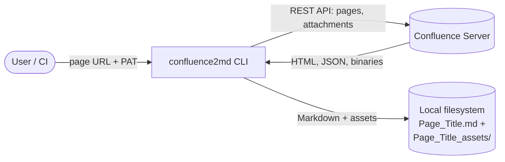
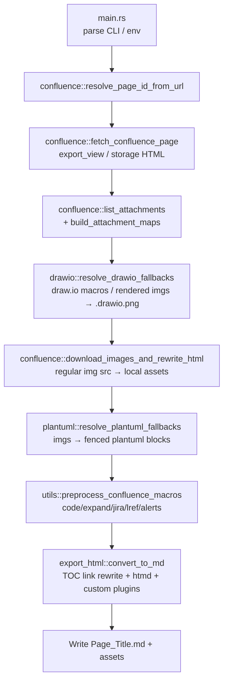
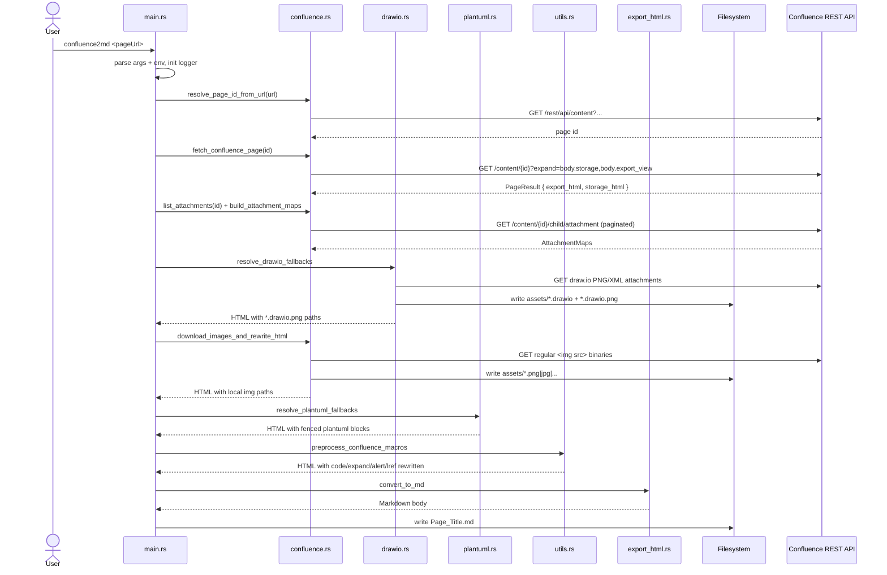
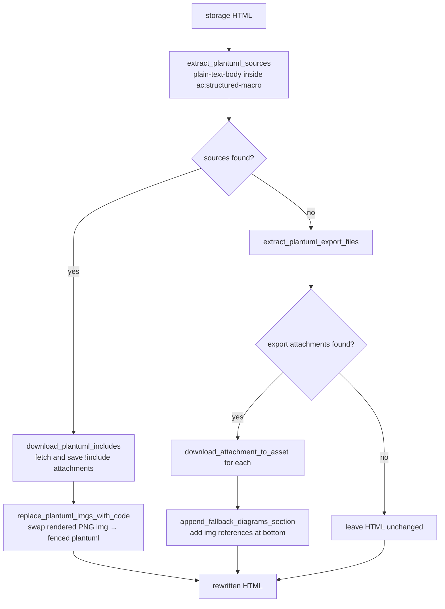
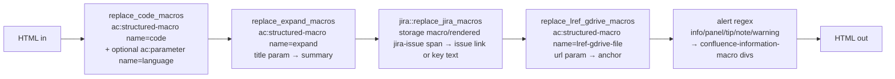

# Architecture Overview

This document describes the architecture of **confluence2md**, a Rust CLI that converts a Confluence page (fetched through the Confluence REST API) into clean, portable GitHub-Flavored Markdown — together with locally stored assets (images, draw.io diagrams, PlantUML).

It is intended to give contributors and AI agents a rapid mental model of the codebase. Update it whenever the module layout, processing pipeline, or supported macros change.

---

## 1. Project Structure

```
confluence2md/
├── src/                    # Rust source (Cargo binary + library)
│   ├── main.rs             # CLI entry point: arg parsing + pipeline orchestration
│   ├── lib.rs              # Library root: re-declares public modules
│   ├── confluence.rs       # Confluence REST client: page/attachment fetch, image rewrite
│   ├── drawio.rs           # draw.io fallback resolution + PNG tEXt embedding
│   ├── plantuml.rs         # PlantUML source extraction + !include rewriting
│   ├── jira.rs             # Jira macro/link normalization
│   ├── export_html.rs      # HTML → Markdown converter (htmd + markup5ever_rcdom)
│   ├── utils.rs            # String/URL/filename helpers, macro preprocessing dispatcher
│   └── logger.rs           # Leveled logging built on `tracing`
├── tests/                  # Integration tests (`tests/integration.rs`)
│   └── *.rs                # Cross-module tests using `wiremock` for HTTP fakes
├── test/                   # Test fixtures
│   └── input/              # e.g. `confluence_content.json`
├── Cargo.toml              # Crate manifest and dependency set
├── mise.toml               # Task runner: `mise run ci`, etc.
├── README.md               # User-facing docs
├── CONTRIBUTING.md         # Developer setup and workflow
├── AGENTS.md               # Rules for AI coding agents
└── ARCHITECTURE.md         # This document
```

---

## 2. High-Level System Diagram

confluence2md runs as a single CLI process. It pulls HTML and binary attachments from a Confluence server and writes a Markdown file plus an `_assets/` directory to the local filesystem.



The CLI itself is internally pipelined: each stage consumes the HTML produced by the previous stage and rewrites it in place.



---

## 3. Core Components

confluence2md is a single Rust crate that exposes one binary (`confluence2md`) and one library (`confluence2md` lib). Modules are split by responsibility; types are co-located with the module that owns them.

### 3.1. `main.rs` — CLI Entry Point

- **Responsibility:** Parse CLI flags (`clap` derive) and environment variables, set up logging, and orchestrate the conversion pipeline end-to-end.
- **Key items:** `Cli` struct, `run()` async function (Tokio multi-thread runtime).
- **Inputs:** `<pageUrl>` arg, `--output-path`, `--log-level`, `--table-conversion`, plus `CONFLUENCE2MD_*` env vars.
- **Outputs:** `Page_Title.md`, `Page_Title_assets/`. When `--dump-state-path <DIR>` or `CONFLUENCE2MD_DUMP_STATE_PATH` is specified, the raw page API snapshot (`content.json`) and debug intermediates (`export.html`, `storage.html`, `rewrite_*.html`) are written to that dump directory.

### 3.2. `confluence` — REST Client and Image Rewriter

- **Responsibility:** Talk to the Confluence REST API v1 and download regular binary assets referenced by the page HTML. draw.io and PlantUML assets are resolved by their dedicated modules first.
- **Key types:** `EnvConfig`, `PageResult`, `Attachment`, `AttachmentMaps`, `DownloadBinaryOptions`, `DownloadAttachmentOptions`, `DownloadImagesOptions`.
- **Key functions:**
    - `build_http_client` — `reqwest` client with `rustls-tls`.
    - `get_required_env` — reads the personal access token from `CONFLUENCE2MD_PERSONAL_ACCESS_TOKEN`.
    - `resolve_page_id_from_url` — supports `pageId`, `/spaces/.../pages/<id>/`, `/display/<space>/<title>`, and `spaceKey`+`title` URL formats.
    - `fetch_confluence_page` — fetches the page with `body.export_view` and `body.storage` expansions.
    - `list_attachments`, `build_attachment_maps` — paginated attachment listing keyed by title and by media ID.
    - `download_images_and_rewrite_html` — replaces regular `` values with local relative paths under the assets directory, skipping PlantUML endpoints and assets already rewritten to local paths.

### 3.3. `drawio` — draw.io Diagram Resolution

- **Responsibility:** Detect draw.io diagrams from both Confluence storage macros and rendered export-view `` tags, download their PNG renders and raw XML, embed the XML into the PNG as a `tEXt` chunk so the file remains editable in the draw.io VS Code extension, and rewrite the HTML to point at the local `.drawio.png` files.
- **Key types:** `DrawioDiagramRef`, `ResolveDrawioOptions`, `FallbackDiagram`, `FallbackResult`.
- **Key functions:** `extract_drawio_diagrams`, `extract_drawio_diagram_names`, `replace_drawio_script_blocks_with_imgs`, `replace_drawio_img_srcs`, `filter_mxfile_to_aspect_hash`, `embed_drawio_xml_in_png`, `append_fallback_diagrams_section`, `resolve_drawio_fallbacks` (top-level entry).
- **Notable detail:** multi-page diagrams are disambiguated by an `aspectHash` suffix; the raw `.drawio` XML is parsed with `quick-xml` and filtered down to the matching `<diagram>` via `filter_mxfile_to_aspect_hash`, while the unfiltered XML is saved once and shared across pages. Rendered draw.io images inside included content such as Table Excerpt Include are converted into the same internal asset-source model as native page draw.io macros, so external-page attachments use the same download, XML embedding, save, and rewrite path.
- **Cross-module note:** `append_fallback_diagrams_section` lives in this module but is also used by `plantuml::resolve_plantuml_fallbacks` to append image-only PlantUML fallbacks at the bottom of the HTML.

### 3.4. `plantuml` — PlantUML Resolution

- **Responsibility:** Replace Confluence's server-rendered PlantUML `` tags with fenced `plantuml` code blocks containing the original source, downloading any `!include`d attachments alongside.
- **Key types:** `ResolvePlantUmlOptions`, `DownloadIncludesOptions`.
- **Key functions:** `extract_plantuml_sources`, `replace_plantuml_imgs_with_code`, `download_plantuml_includes`, `extract_plantuml_export_files` (for the image-only fallback path), `resolve_plantuml_fallbacks` (top-level entry).

### 3.5. `export_html` — HTML to Markdown Converter

- **Responsibility:** Convert the rewritten Confluence HTML into GitHub-Flavored Markdown.
- **Key types:** `TableConversion` (`Default` | `Always`), `ConvertOptions`.
- **Key function:** `convert_to_md`.
- **Built on:** [`htmd`](https://crates.io/crates/htmd) and [`markup5ever_rcdom`](https://crates.io/crates/markup5ever_rcdom), with custom plugins for Confluence alert/expand/code blocks and table preprocessing.
- **TOC behavior:** Before Markdown conversion, `convert_to_md` maps Confluence heading `id` attributes to the Markdown heading slugs generated from the heading text, then rewrites internal `<a href="#...">` links that point at those headings. This keeps Confluence TOC macro output navigable in Markdown without adding raw `<a id="..."></a>` anchors to the document.
- **Table-conversion behavior:**
    - Both modes unwrap 1x1 tables before normal table conversion: the single cell's content is emitted as regular Markdown outside a table. This keeps block content such as PlantUML fences readable instead of forcing it into a one-cell GFM table.
    - `Default`: Markdown-compatible tables are converted to GFM; tables without `<thead>` have their first row promoted to a header. Tables with merged cells (`colspan`/`rowspan`) or nested tables are preserved as readable, pretty-printed HTML.
    - `Always`: merged cells are expanded to a flat grid, and nested tables are extracted to standalone markdown tables appended after the outer table; outer-table cells keep unique markers such as `(*1)` for mapping.

### 3.6. `jira` — Jira Macro/Link Normalization

- **Responsibility:** Convert Confluence Jira issue macros and rendered `jira-issue` spans to simple issue links.
- **Key function:** `replace_jira_macros`.
- **Behavior:** Rendered Jira spans become a single `<a href="...">KEY</a>` link, dropping summary/status placeholder text such as `Getting issue details...` and `STATUS`. Storage-format Jira macros use a Jira browse base URL derived from rendered Jira issue links in the same Confluence REST API response. If no rendered link is available, the macro emits the issue key as plain text instead of hardcoding a Jira host.

### 3.7. `utils` — Shared Helpers and Macro Preprocessing

- **Responsibility:** Cross-cutting helpers and the central Confluence-macro-to-HTML rewriter.
- **Key types:** `AssetsInfo`, `HeaderHints`.
- **Key helpers:** `sanitize_file_name`, `decode_html_attribute`, `decode_html_text`, `strip_tags`, `normalize_base_url`, `resolve_url`, `ext_from_content_type`, `escape_html`, `get_file_name_from_url_or_headers`, `make_assets_info`, `to_markdown_asset_path`, `ensure_dir`, `extract_macro_blocks`, `extract_macro_param`.
- **Macro preprocessor:** `preprocess_confluence_macros` chains the per-macro rewriters: `replace_code_macros` → `replace_expand_macros` → `jira::replace_jira_macros` → `replace_lref_gdrive_macros` → alert macros (info / panel / tip / note / warning).

### 3.8. `logger` — Leveled Logging

- **Responsibility:** Initialize `tracing_subscriber` with a parsed log level.
- **Key items:** `LogLevel` enum (`Debug` | `Info` | `Warning` | `Error`), `parse_log_level`, `init`.

---

## 4. Processing Flow

### 4.1. End-to-End Sequence



### 4.2. Macro-by-Macro Processing

confluence2md supports a fixed set of Confluence macros. Each is detected and rewritten by a specific stage of the pipeline. The two columns below show *where* in the pipeline the macro is consumed and *what* the resulting Markdown looks like.

| Macro              | Stage (module::function)                         | Resulting Markdown / HTML                                                                                                                                                                                                                                                                           |
| ------------------ | ------------------------------------------------ | --------------------------------------------------------------------------------------------------------------------------------------------------------------------------------------------------------------------------------------------------------------------------------------------------- |
| `drawio`           | `drawio::resolve_drawio_fallbacks`               | `` — PNG with `.drawio` XML in `tEXt`. Native page draw.io macros and rendered draw.io images inside included content are resolved through the same asset pipeline.                                                                                                 |
| `plantuml`         | `plantuml::resolve_plantuml_fallbacks`           | Fenced code block: ` ```plantuml ... ``` `                                                                                                                                                                                                                                                          |
| `code`             | `utils::preprocess_confluence_macros` (`code`)   | Fenced code block with optional language: ` ```c++ ... ``` `                                                                                                                                                                                                                                        |
| `expand`           | `utils::preprocess_confluence_macros` (expand)   | `<details><summary>Title</summary> ... </details>`                                                                                                                                                                                                                                                  |
| `jira`             | `jira::replace_jira_macros`                      | Simple issue link: `[DEMO-1234](https://jira.example.com/browse/DEMO-1234)`. Storage macros derive the browse URL from rendered Jira links when available; otherwise they emit plain key text.                                                                                                      |
| `lref-gdrive-file` | `utils::preprocess_confluence_macros` (gdrive)   | `[Google Drive Link](https://docs.google.com/...)`                                                                                                                                                                                                                                                  |
| `info`             | `utils::preprocess_confluence_macros` (alerts)   | GitHub `[!IMPORTANT]` alert block                                                                                                                                                                                                                                                                   |
| `panel`            | `utils::preprocess_confluence_macros` (alerts)   | GitHub `[!NOTE]` alert block                                                                                                                                                                                                                                                                        |
| `tip`              | `utils::preprocess_confluence_macros` (alerts)   | GitHub `[!TIP]` alert block                                                                                                                                                                                                                                                                         |
| `note`             | `utils::preprocess_confluence_macros` (alerts)   | GitHub `[!WARNING]` alert block                                                                                                                                                                                                                                                                     |
| `warning`          | `utils::preprocess_confluence_macros` (alerts)   | GitHub `[!CAUTION]` alert block                                                                                                                                                                                                                                                                     |
| (regular ``)  | `confluence::download_images_and_rewrite_html`   | ``                                                                                                                                                                                                                                                                       |
| (tables)           | `export_html::convert_to_md` (`TableConversion`) | 1x1 tables are unwrapped to their single cell content. `Default`: Markdown-compatible tables become GFM; merged/nested tables are preserved as pretty-printed HTML. `Always`: merged cells expanded to flat GFM tables; nested tables extracted after the outer table with unique markers (`(*n)`). |

#### 4.2.1. draw.io flow

```mermaid
flowchart TD
    A[storage HTML] --> B[extract_drawio_diagrams<br/>diagram name + aspectHash]
    C[export_view HTML] --> D[extract rendered draw.io imgs<br/>including Table Excerpt Include content]
    B --> E[build DrawioAssetSource<br/>from current-page attachments]
    D --> F[build DrawioAssetSource<br/>from /download/attachments/{pageId}/...]
    E --> G[order_drawio_sources<br/>match rendered imgs to storage sources]
    F --> G
    G --> H[GET PNG bytes]
    H --> I{.drawio XML<br/>available?}
    I -- yes --> J[GET XML once, cache by URL]
    J --> K[save assets/<name>.drawio]
    K --> L[embed_drawio_xml_in_png<br/>tEXt chunk]
    I -- no --> M[keep raw PNG]
    L --> N[save assets/<name>-<hash>.drawio.png]
    M --> N
    N --> O[replace_drawio_script_blocks_with_imgs<br/>+ replace_drawio_img_srcs]
    O --> P[rewritten HTML]
```

#### 4.2.2. PlantUML flow



#### 4.2.3. `code` / `expand` / `jira` / `lref-gdrive-file` / alert flow

These are pure HTML-to-HTML rewrites coordinated by `utils::preprocess_confluence_macros`. They run **after** draw.io, regular image, and PlantUML resolution so that the downstream `htmd` converter sees only standard HTML.



The alert `<div>`s use the same class names the Confluence export view would emit; `export_html::convert_to_md` then maps those classes to GitHub `[!IMPORTANT|NOTE|TIP|WARNING|CAUTION]` blocks during the final Markdown conversion.

Jira storage macros do not carry a browse URL. `jira::replace_jira_macros` derives the browse base from rendered Jira issue links already present in the REST response, avoiding any hardcoded Jira instance. Rendered issue spans are normalized to only the issue-key link so placeholder summary/status text is not emitted to Markdown.

### 4.3. HTML Source Selection

`fetch_confluence_page` requests both `body.export_view` and `body.storage` from the API. `body.export_view` is the main HTML stream converted to Markdown, while `body.storage` is retained as a side input for macro metadata such as draw.io diagram names, draw.io `aspectHash` values, PlantUML sources, and task-list completion state.

Some included content, for example Table Excerpt Include output, appears only as rendered export-view HTML from another page. draw.io therefore also inspects rendered `drawio-diagram-image` tags and derives the source attachment page from `/download/attachments/{pageId}/...` URLs.

---

## 5. Data Stores

confluence2md is **stateless**. The only persistent outputs are local filesystem artifacts:

| Artifact                          | Path (relative to output dir)     | Purpose                           |
| --------------------------------- | --------------------------------- | --------------------------------- |
| Converted page                    | `Page_Title.md`                   | Final Markdown                    |
| Image / draw.io / PlantUML assets | `Page_Title_assets/*`             | Locally referenced binaries       |
| Raw draw.io XML                   | `Page_Title_assets/<name>.drawio` | Editable source for `.drawio.png` |

When `--dump-state-path <DIR>` or `CONFLUENCE2MD_DUMP_STATE_PATH` is specified, the following diagnostic files are written relative to the dump directory instead:

| Artifact                             | Path (relative to dump dir)                                                                                                | Purpose                              |
| ------------------------------------ | -------------------------------------------------------------------------------------------------------------------------- | ------------------------------------ |
| Raw content API response             | `content.json`                                                                                                             | Fixture source for integration tests |
| Debug intermediates (HTML snapshots) | `export.html`, `storage.html`, `rewrite_drawio.html`, `rewrite_image.html`, `rewrite_plantuml.html`, `rewrite_macros.html` | Inspect each pipeline stage          |

There is no database, cache, or message queue.

---

## 6. External Integrations / APIs

- **Confluence REST API v1** — read-only access to pages and attachments: `GET /rest/api/content/{id}?expand=body.storage,body.export_view`, `GET /rest/api/content/{id}/child/attachment` (paginated), `GET /rest/api/content/search?cql=...` (for title-based URL resolution), and binary downloads under `/download/attachments/{pageId}/...`.
- **Authentication:** HTTP `Authorization: Bearer <token>` using a Personal Access Token.

No other external services are called.

---

## 7. Deployment & Infrastructure

- **Form factor:** Single self-contained Rust binary (release profile: `lto = "fat"`, `codegen-units = 1`, stripped).
- **Distribution:** GitHub Releases (`https://github.com/Toyota/confluence2md/releases`).
- **CI:** `mise run ci` runs `cargo fmt --check`, `cargo clippy --all-targets -- -D warnings`, `cargo build`, `cargo test`, and `cargo-machete` in sequence. This is the mandatory pre-merge gate.
- **Runtime requirements:** stable Rust toolchain (MSRV pinned in `Cargo.toml`, currently `1.95`, edition 2024); network reachability to the target Confluence server.

---

## 8. Security Considerations

- **Authentication:** Confluence Personal Access Token, read from `CONFLUENCE2MD_PERSONAL_ACCESS_TOKEN`. Never logged.
- **Transport:** HTTPS via `reqwest` with `rustls-tls` (no OpenSSL dependency).
- **Authorization:** Whatever the token's owner can read in Confluence.
- **Sandbox:** Output is restricted to the resolved `--output-path` directory. `sanitize_file_name` strips path separators and forbidden characters to prevent path traversal in attachment titles.
- **No `unsafe`:** The crate compiles without `unsafe` blocks; lints are enforced with `-D warnings`.

---

## 9. Development & Testing Environment

- **Local setup:** see [CONTRIBUTING.md](CONTRIBUTING.md).
- **Build / test:** `cargo build`, `cargo test`, `mise run ci`.
- **Unit tests:** `#[cfg(test)] mod tests` at the bottom of each `src/*.rs` file.
- **Integration tests:** under `tests/` (e.g. `tests/integration.rs`); HTTP behavior is faked with [`wiremock`](https://crates.io/crates/wiremock); async tests use `#[tokio::test]`.
- **Fixtures:** `tests/input/confluence_content.json`.
- **Lint / format:** `cargo clippy --all-targets -- -D warnings`, `cargo fmt --all`.

---

## 10. Project Identification

- **Project Name:** confluence2md
- **Repository URL:** https://github.com/Toyota/confluence2md
- **License:** MIT ([LICENSE](LICENSE))

---

## 11. Glossary

- **PAT** — Personal Access Token, used as a bearer credential for the Confluence REST API.
- **Storage HTML** — Confluence's authoring representation containing `ac:*` macro tags. Required for extracting draw.io and PlantUML sources.
- **Export view HTML** — Confluence's fully rendered HTML, used as the primary input to the Markdown converter when available.
- **GFM** — GitHub-Flavored Markdown.
- **`tEXt` chunk** — A PNG metadata chunk; used here to embed the original `.drawio` XML inside the rendered PNG so it remains editable.
- **`aspectHash`** — Confluence's per-page hash for multi-page draw.io diagrams; used to disambiguate output filenames.
